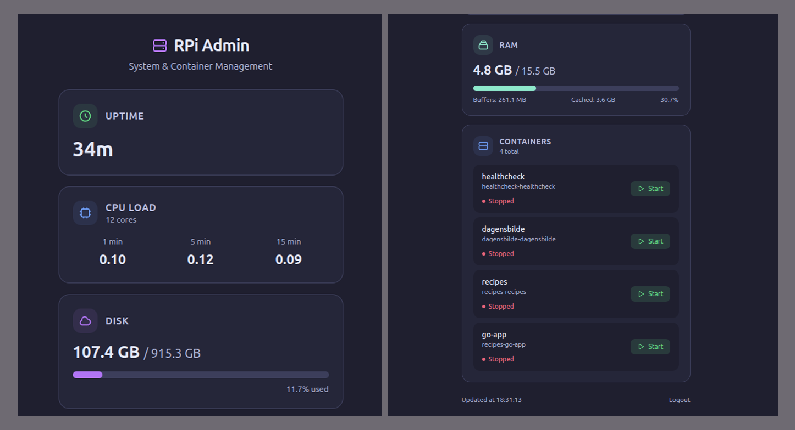

# RPi Admin

A mobile-friendly dashboard for managing a Raspberry Pi. Combines system health monitoring and Docker container management in a single app.

## Screenshots

<p>
  
</p>

## Features

- System health monitoring (uptime, CPU load, disk usage, RAM)
- View all Docker containers and their status
- Start/stop containers with one tap
- Password protected (SHA256) with 1-week sessions
- Dark themed, mobile-first UI

## Setup

Generate a password hash and put it in the env:

```sh
cenv fix

./hashpass.sh
```

### Run locally

```sh
air
```

### Docker compose

```sh
docker compose up -d --build
```
