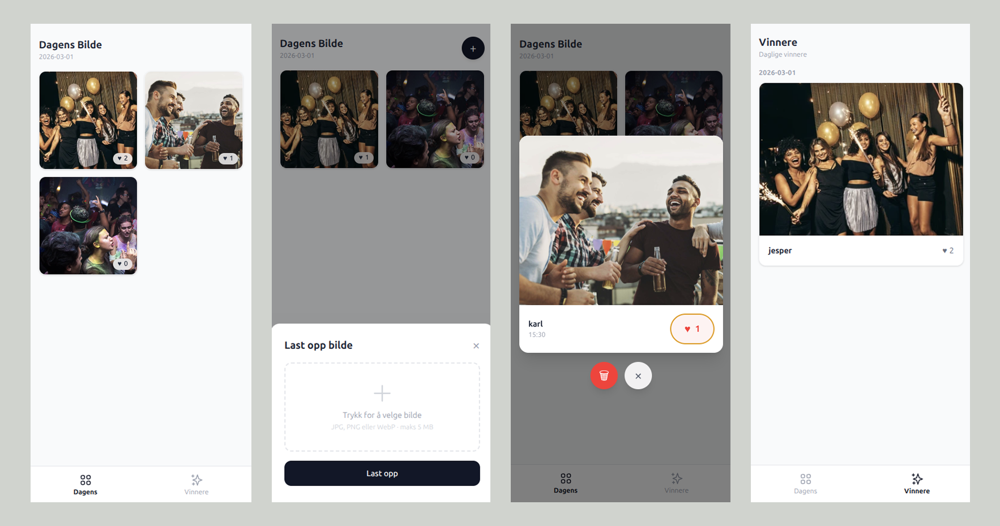

# Dagens Bilde

A mobile-first daily photo sharing app. Each day, users upload one photo. Everyone can like each other's photos, and at the end of the day a winner is chosen based on the most likes.

## Screenshot



## Features

- One upload per user per day
- Like / unlike photos
- Daily winner with historical results feed
- Simple password-based auth (shared password, per-name identity)
- SQLite database with automatic migrations

## Run

Before running the app make sure you generate a password:

1. Generate a password hash:

```sh
go run ./cmd/hashpassword "your-password"
```

2. Run `cenv fix` to create the `.env` file and fill in the hashed password from step 1.

### Running with Docker Compose

```sh
docker compose up --build -d
```

The app will be available at `http://localhost:8080`. All persistent data (database and uploaded images) is stored in the `./data` directory on the host.

### Running locally

```sh
air
```
